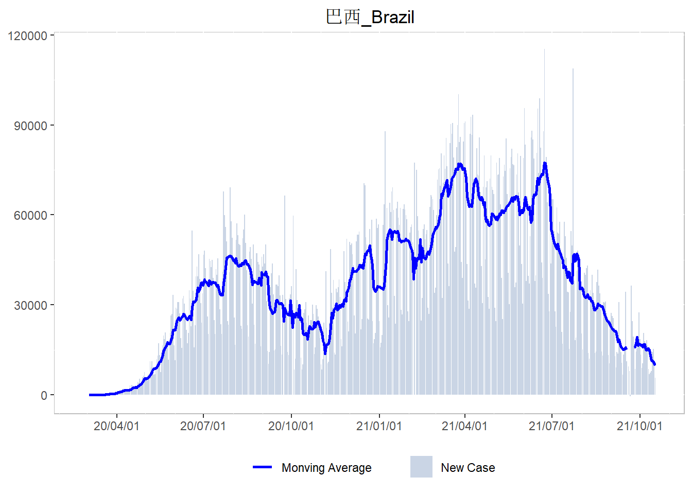

COVID-19 的病例数据来源于[COVID-19 (coronavirus) by Our World in Data](https://github.com/owid/covid-19-data/tree/master/public/data)，并通过 OWID data 绘制一张新冠肺炎新增病例的趋势图。


```r
rm(list = ls())
options(digits = 4)

library(readxl)
covid <- read.csv("owid-covid-data.csv")
```

为了得到每个国家对应的中文名称，还需要导入“国家和地区代码.xlsx”文件。


```r
country <- read_excel("国家和地区代码.xlsx",
                     col_names=TRUE)
```

选取 Brazil 作为分析对象，对数据做一些简单的处理和 mapping


```r
covid1 <- subset(covid, 
                 subset = (iso_code=="BRA"))

covid2 <- transform(covid1, 
                    peo_vac=people_vaccinated/10000, 
                    peo_fvac=people_fully_vaccinated/10000,
                    ana_new=new_cases,
                    ana_dea=new_deaths,
                    low=0
                    )

country1 <- subset(country, 
                   subset = (X6!="NA"), 
                   select = c(X2,X3,X6))

library(dplyr)
anadata1 <- left_join(covid2,
                      country1,
                      by=c("iso_code"="X6"))
```

定义一个移动平均数的函数，得到移动平均值


```r
mav <- function(a,n=3){
stats::filter(a,rep(1/n,n),sides = 1)
}
anadata2 <- transform(anadata1,
                      mean_new=mav(ana_new,7),
                      mean_dea=mav(ana_dea,7))
```

利用 ggplot2 绘图


```r
library(ggplot2)
gtitle <- paste(anadata2$X2,"_",anadata2$X3,sep='')[1]
p <- ggplot(anadata2,aes(x=as.Date(date))) + 
  geom_col(aes(y=ana_new,fill="g_col")) + 
  geom_line(aes(y=mean_new,color="g_line"),size=1) +
  ggtitle(gtitle) +
  labs(x=NULL,y=NULL) +
  scale_x_date(date_label="%y/%m/%d",
               date_breaks = "3 month",
               minor_breaks = "1 month") +
  scale_fill_manual(breaks = c("g_col"), 
                    values = c("#cad5e5"), 
                    label = c("New Case")) + 
  scale_color_manual(breaks = c("g_line"),
                     values = c("blue"), 
                     label = c("Monving Average")) +
  theme(plot.title =element_text(hjust = 0.5, vjust = 0.5), 
      legend.position = "bottom", 
      legend.title = element_blank(), 
      legend.background = element_blank()) 

p + theme(panel.background=element_rect(fill='transparent', 
                                      color='gray'),
        legend.key=element_rect(fill='transparent', 
                                color='transparent'))
```



最后展示一下输出的plot，如上图所示。
